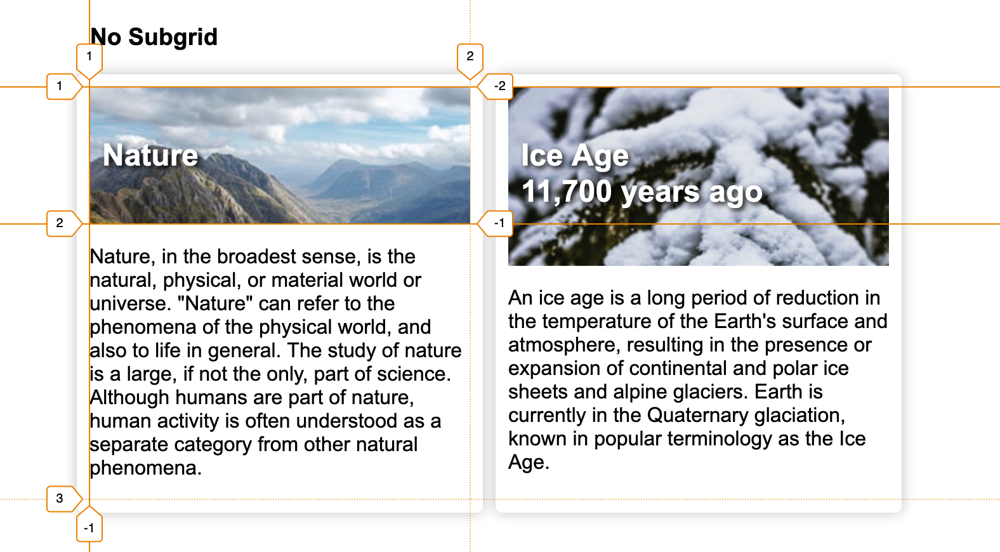
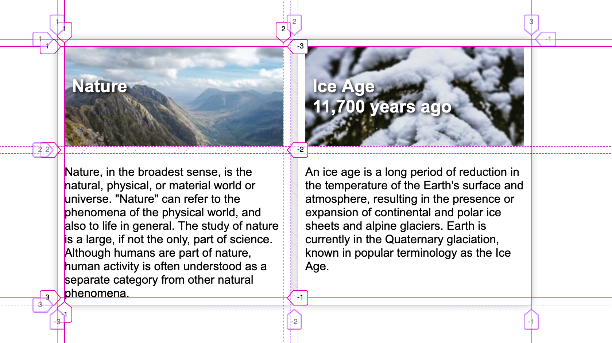

CSS Subgrid is a part of <a href="https://www.w3.org/TR/css-grid-2/" target="_blank">CSS Grid Level 2 Spec</a> by CSS working group. It solves a common use case which wasn't so obvious when grids were launched. Let's dig deep into what it is!

CSS grids are primary used for building complex layouts for the web. And when you start building such layouts, there would be use-cases where you would want to use grids for child components as well. This is great! But there is one non-obvious thing that happens when you do so.

Each time you write `display: grid`, a new grid context is created which is totally unaware of the parent grid.

Now, due to this obscure spec, you would end up with layouts that are not aligned to your main grid(parent's grid) of the webpage. And it's because of this problem, Subgrid are here.

> Subgrid allows a grid-item with its own grid to align in one or both dimensions of the parent's grid

Here is an example of a two-column grid container with two child elements.



In this case, the two cards are a part of grid and are aligned properly. But in you see the content of the grid, they are aligned differently for each other although the card itself is a grid.

```css
/* Styles for grid without subgrid */
.container {
  display: grid;
  grid-template-columns: repeat(2, minmax(50px, 1fr));
  grid-gap: 10px;
  .card {
    display: grid;
  }
}
```

### With Subgrid

When you specify the child card as a subgrid, then we can specify the child to use parent's grid (with auto rows in this case).



Here, the grid line No. 2 is the same for both the cards, thus making the alignment same.

```css
/* Styles for grid with subgrid */
.container {
  display: grid;
  grid-template-columns: repeat(2, minmax(50px, 1fr));
  grid-gap: 10px;
  .card {
    display: grid;
    grid-row: span 2;
    grid-template-rows: subgrid;
  }
}
```

PS: Properties like `grid-gap` and `names grid lines` are also inherited by the subgrid from parent grid.

_Checkout the above example for yourself in [Codepen](https://codepen.io/apvarun/pen/RmXOzX)._

Currently the __Subgrid__ spec is only available in Mozilla Firefox Nightly release, but support for other browsers are also currently being worked upon. [caniuse.com](https://caniuse.com/#feat=css-subgrid)

---

__Bonus:__ Here is a Scrimba Screencast that explains Subgrid with code.

<iframe width="560" height="315" src="https://scrimba.com/c/cgq2knS6" frameborder="0"></iframe>
