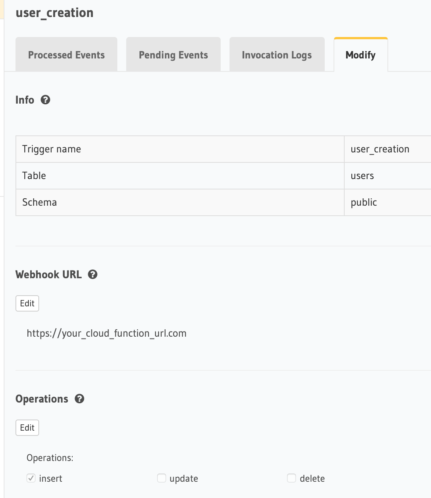
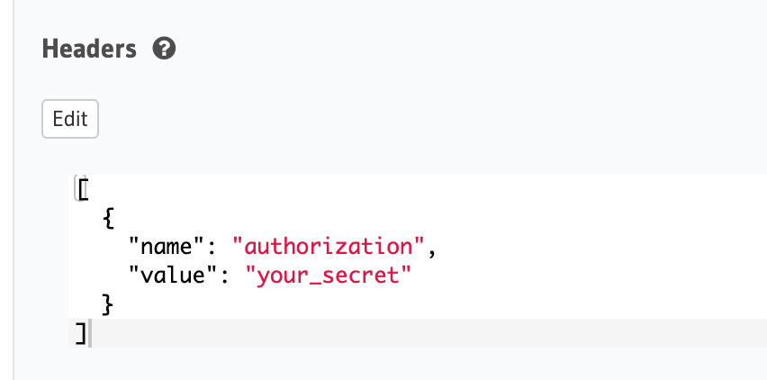

Hasura’s GraphQL engine is itself a drop-in backend for most of the use cases. It provides you the flexibility to setup a fully functional backend with GraphQL as interface for the front-end. It acts as a layer between the Postgres database and your frontend applications(web or mobile).

Authentication is entirely a different class of problem which is also common for any kind of application. Hasura already has documentation as to how their platform can be made to work with Auth0 or Firebase authentication service. 🔥

Everything seemed perfect when I started. And I chose firebase as their auth service doesn’t have a user count based pricing (at least at the time of writing this). This would definitely save a couple of $$ as the application scales.

And so I went ahead with the implementation.

---
## The Problems
But I encountered a problem. As per the documentation, I had to create accounts using the firebase client-side SDK. This was a bummer for me as I had to create bulk accounts for my use case.

Another problem was that if I went ahead and created accounts using client-side API, I would also have to relay the same details(except password) to my datastore(GraphQL engine) as well. This is really unintuitive and doesn’t ensure that the information is present in both locations.

---
## How did I address it?
**T.L.D.R**: Event Triggers + Cloud functions

GraphQL engine also has support for event triggers which can be setup to call web hooks based on DB operations. Any insert, update or delete operation on tables via the GraphQL endpoint will trigger the events associated with it.

I was able to set up cloud functions that can be called on insert events, cloud function being hosted on firebase functions. The end point of the cloud function is given to event triggers, which then makes a POST call when the event is fired.


#### Sample cloud function to create user

```js
const functions = require("firebase-functions"),
  admin = require("firebase-admin"),
  express = require("express"),
  cors = require("cors"),
  bodyParser = require("body-parser"),
  generator = require("generate-password"),
  env = require("./envfile");

const app = express();
app.use(cors({ origin: true }));
app.use(bodyParser.urlencoded({ extended: false }));
admin.initializeApp(functions.config().firebase);

app.post("/", (req, res) => {
  
  // Check for POST request
  if (req.method !== "POST") {
    res.status(400).send("Request not supported");
    return;
  }

  // Destructure POST params
  let { email, accountrole, id } = req.body.event.data.new,
    headers = req.headers;

  // Custom header for API call authorization
  if (headers.authorization !== env.authKey) {
    res.status(404).send("Unkonwn error");
    return;
  }

  // Generate account password
  const password = generator.generate({
    length: 12,
    numbers: true
  });

  admin
    .auth()
    .createUser({
      email: email,
      emailVerified: false,
      password,
      uid: String(id)
    })
    .then(userRecord => {
      // See the UserRecord reference doc for the contents of userRecord
      console.log("Successfully created new user foe email  ", email);

      // Send them an email with initial password or a password reset link
      // SendEmail(...)

      // Custom claims for validation by the GraphQL engine
      const customClaims = {
        "https://hasura.io/jwt/claims": {
          "x-hasura-default-role": accountrole,
          "x-hasura-allowed-roles": ["admin", "user"],
          "x-hasura-user-id": id
        },
        authorized: false // custom parameter that can be updated later
      };

      // Assign custom claims
      return admin
        .auth()
        .setCustomUserClaims(userRecord.uid, customClaims)
        .then(() => {
          console.log("Custom claims set for " + email);
        })
        .catch(console.log);
    })
    .catch(error => {
      console.log("Error creating new user:", error);
    });
});

exports.user = functions.https.onRequest(app);
```

As the signup form is filled by the user, a mutation is fired to insert the data into the user table. This will then post the same information to the cloud function using the event trigger.



The trigger runs only on new insertions to the user table.

Note that since we have a check for headers in the cloud function, you will also need to pass the secret token in header as below.



So, once the signup is done, an user will be created in the firebase auth (with email and generated password).

And in order to login, we can use the firebase auth script and directly authenticate from the UI.

## What's achieved

> Signup process can inlcude multiple meta information along with username/email. (password being autogenerated by this process).

If we were to signup user directly to firebase using their SDK, we would have to send two parallel API calls at the least to have user information in our DB as well. This is simplified and made one way so that there is no inconsistency in storage of userdata.

> You will now be able to create accounts in bulk as the event triggers are fired for each insert to the table. The process becomes to fully event driven.

---

Hope this was helpful for someone out there trying to tackle the same problems. I'd love to hear from you on [twitter](https://twitter.com/intent/tweet?url=https%3A%2F%2Fapvarun.com%2Ffirebase-graphql-engine-auth/&&text=@apvarun%20&original_referer=) in case of any queries or suggestions.

