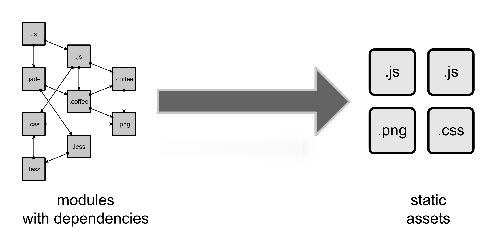

Parcel is module bundler that requires no initial configuration for to get it running. It is also dubbed as **zero configuration web application bundler** for the same reason, unlike Webpack which requires manual configuration.

> [Parcel](https://parceljs.org/) is blazingly fast (as advertised) when it comes to compilation and bundling

It also comes with features like support for a wide set of asset types, code splitting and hot module replacement for easier debugging. All these make it optimal and fast in execution.

## In case you are still wondering?

### \> Bundling

Bundling is a process of combining various types of resources/files that a project requires in an optimal way. It helps the browser to load the page faster, with lesser round trips to the server.

## What makes Parcel worth the try?

I've been working on a couple of React projects recently. All of the projects were using Webpack for packaging the app for production.

Every was working fine, until the time I included a large UI component library (<s>Name?</s>). After including the same for the build, Webpack build time increased drastically.

It took more that **40 seconds** for the build. You might think that it is fine and build is only for prod (mostly handled by CI). And yes it is! However, the actual problem was for the consecutive builds in dev mode.

Even with HMR enabled, the page started to take a toll. I would need to wait for like 10s for verifying the changes.

This got me thinking!!! And it was the exact time I saw Devon Govett's [tweet](https://twitter.com/devongovett/status/1007291359336677377) about a new version of parcel. I decided to give it a try.

### Initial impressions?

> This is so good! 😍

Parcel does a lot of things for you that you don't even need to think of any. You can focus on your code and getting the logic right, rather than dev environment setup.

Since it does the bundling based on files, the HMR was so effective that my concurrent dev builds took **less than a second** (usually around 400ms).

## Only bundling?

Later on, I started exploring options to use it instead of task runners such as Gulp. Thanks to a couple of available plugins, I was able to set up live reload, compilation for markdown, and code linting.

Did I miss out to tell you that it also transpiles your ES6+ code using babel to ES5? Yeah, you heard it right.

Check out the full list of plugins and other awesome stuff available for Parcel here. [Awesome Parcel Github Repo](https://github.com/parcel-bundler/awesome-parcel)

**Did you know?** Parcel can also bundle your Node apps by just setting the target as node in your npm scripts.

## What's next

I would start using parcel for almost everything when I work on side projects. It will not replace Webpack completely as webpack ecosystem is much larger due to it's long time existence.

I've also been working on some plugins for parcel that could help other developers at certain use cases.

> _Try parcel for yourself, and you will start embracing it._
